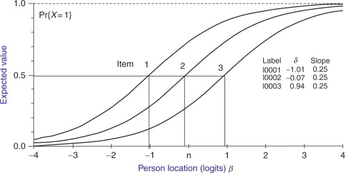

# Measurement in AI

## Basic of Measurement & Item Response Theory

### Response Matrx:&#x20;

Response matrix is a matrix with $$N$$ (number of models) rows and $$M$$(number of benchmark questions) columns, and generally each entry $$Y_{ij}\in \{ 1,0\}$$ denotes whether the model $$i$$ get question $$j$$ correct.&#x20;

### Rasch Model (1PL)&#x20;

Notation: $$\theta$$ describes model capability / ability. $$\beta$$ describes item difficulty, and $$\alpha$$ describes item informativeness&#x20;

$$
P(Y_{ij}=1|\theta_i, \beta_j)=\sigma(\theta_i-\beta_j)=\frac{1}{1+e^{-(\theta_i-\beta_j)}}
$$

So in 1PL model, we say the probability of a model $$i$$ answering question $$j$$ correctly is based on model capability and item difficulty. If $$\theta_i=\beta_j$$, then $$p=0.5$$, and so on.&#x20;

Benefit:&#x20;

* In this framework, two models with the same accuracy are not actually equal if one got harder question right.&#x20;
* coefficients are estimated with standard error&#x20;
* you can make prediction on unseen items&#x20;
* you can derive information function $$I(\theta)=\sum_{j=1}^M P_j(\theta)(1-P_j(\theta))$$ where $$P_j(\theta)=\sigma(\theta-\beta_j)$$. This function will tell you at what range of model capability does the benchmark most informative (peak of the function).&#x20;

**Item characteristic curves (ICC)** is a curve with ability on the x-axis and probability of answering item correctly on the y-axis. So we would have multiple item curves based on the item difficulty.&#x20;

<figure><figcaption>
Example of ICC
</figcaption></figure>

**Saturation under IRT**: a benchmark is saturated when all item difficulties $$\beta_j$$ are below the frontier model abilities $$\theta_i$$. In this cause the information function is virtually 0. SOTA claim on saturated benchmark is measuring noise at the top of the scale.&#x20;

#### Useful properties under assumption of Rasch model&#x20;

**Sufficiency of sum scores**&#x20;

&#x20;$$S_i=\sum_{j}Y_{ij}$$ is a sufficient statistics for $$\theta_i$$, hence $$P(Y_i|S_i, \theta_i)=P(Y_i|S_i)$$. So knowing which item is correct gives you nothing compare to knowing how many is correct (hence accuracy is enough).&#x20;

**Specific Objectivity**

Model comparisons are item-independent, $$\frac{\textbf{odds}(Y_{ij}=1)}{\textbf{odds}(Y_{kj}=1)}=exp(\theta_i-\theta_k)$$, so comparing the performance of two models are item-agnostic.&#x20;

But in reality, there are many ways in which Rash model / IRT doesn't hold.&#x20;

* IRT assumes $$Y_{ij} \perp Y_{ik} | \theta_i$$, but LLMs have systematic failures.&#x20;
* LLMs don't guess randomly&#x20;
* some benchmark items leak into training data, changing effective $$\beta_j$$ without the item changing&#x20;

### Two-Parameter Logistic (2PL)

$$
P(Y_{ij}=1)=\sigma(\alpha_j(\theta_i-\beta_j))
$$

where $$\alpha_j$$ is the discrimination of item $$j$$. High $$\alpha_j$$ means steep ICC, sharply distinguishes ability, and low $$\alpha_j$$ means flatter ICC, less informative.&#x20;

### Three-Parameter Logistic (3PL)

$$
P(Y_{ij}=1)=c_j + (1-c_j)\sigma(\alpha_j(\theta_i-\beta_j))
$$

where $$c_j\in [0,1]$$ is the guessing parameter. Higher $$c_j$$ means easier to guess, generally is $$\frac{1}{\textbf{number of item}}$$

### K-Factor Logistic Models&#x20;

$$
P(Y_{ij=1}|U_i, V_j, Z_j)=\sigma(U_i^TV_j + Z_j)
$$

where $$U_i\in \mathbb{R}^K$$ is the ability vector of model i, $$V_j \in \mathbb{R}^K$$ is the loading vector of item $$j$$, and finally $$Z_j \in \mathbb{R}$$ is the ifficulty intercept of item $$j$$

## Comparison / Rank Model&#x20;

### Bradley - Terry Model

$$
P(\textbf{model i beats model j})=\sigma(\theta_i-\theta_j)
$$

here $$\theta$$ is the strength of the model. Overall this has the same form as Rasch, but different interpretation since there is no item response, it is simply model comparison.&#x20;

### Elo Rating System&#x20;

$$
R_i^{new}=R_i + K(S_i-E_i)
$$

where $$S_i \in \{0, 0.5, 1\}$$ denotes the outcome, and $$E_i=\sigma(\frac{(R_j-R_i) ln(10)}{400})$$ and $$K$$ is a learning rate parameter.&#x20;

## Factor Models&#x20;

$$
P(Y_{ij}=1|U_i, V_j, Z_j) =\sigma(U_i^TV_j+Z_j)
$$

where $$U_i \in \mathbb{R}^K$$ is the ability vector of model i, $$V_j \in \mathbb{R}^K$$ is the loading vetor of item $$j$$ into different dimension, and $$Z_j \in \mathbb{R}^K$$ is the difficulty intercept of item $$j$$.&#x20;

In matrix form, we have&#x20;

$$
\Theta=UV^T+1Z^T
$$

where $$U \in \mathbb{R}^{N \times K}$$, $$V \in \mathbb{R}^{M \times K}$$, $$Z \in \mathbb{R}^{M}$$

Typically, the we let $$K\in \{1,2,4\}$$

## Dealing with low fill rate and incomplete

### Proceed as normal&#x20;

Typical benchmark fill rate is 1-20%. Under the assumption of missing at random, we just proceed as normal and only operate on the observed set $$\Omega$$. We can then do logistic matrix completion&#x20;

$$
\begin{align*} &\min_{U,V,Z} -\sum_{(i,j)\in\Omega}\log P(Y_{ij}|U_i,V_j,Z_j) \\& \text{where } P_{ij}= \sigma(U_i^TV_j+Z_j)\end{align*}
$$

Note this is essentially collaborative filtering applied to binary correctness data&#x20;

### Cold-Start

A new model has zero observed response, so the matrix completion above can't help. Same as new item getting released.&#x20;

On model set, we can take metadata $$F_i$$ (e.g., parameter count, architecture family, training data size, release date), and then learn a function $$f_u : F_i \to \hat{U}_i$$ to predict the ability vector from meta data&#x20;

On item side, we can use text embedding $$E_j$$ to learn $$f_v: E_j \to (\hat{V}_j, \hat{Z}_j)$$

* but a surprise finding, semantic similarity does not imply behavioral similarity&#x20;
*

$$ $K \in \{1, 2, 4\} $$

## Estimating IRT Model and Inference&#x20;

### Estimation of Rasch Model through JMLE &#x20;

Under local independence (given $$\theta_i$$, responses to different items are independent), then we have the joint likelihood and negtive log-likelihood

$$
\begin{align*} L(\theta, \beta|Y) &=\prod_{i,j}P_{ij}^{Y_{ij}}(1-P_{ij})^{1-Y_{ij}}  \\ l(\theta,\beta) &= -\sum_{i=1}^N\sum_{j=1}^M\left[Y_{ij}(\theta_i-\beta_j)-log(1+e^{\theta_i-\beta_j})\right] \end{align*}
$$

where $$P_{ij}=\sigma(\theta_i-\beta_j)$$.&#x20;

We can then fit parmeters using gradient descent with stepsize $$\gamma_t$$

$$
\theta_i^{t+1}=\theta_i^{t}-\gamma_t*\frac{\partial l(\theta,\beta)}{\partial\theta_i}, \textbf{where} \frac{\partial l(\theta,\beta)}{\partial\theta_i}=\sum_{j=1}^M[Y_{ij}-P_{ij}] \\\beta_j^{t+1}=\beta_j^{t}-\gamma_t*\frac{\partial l(\theta,\beta)}{\partial\beta_j}\textbf{where} \frac{\partial l(\theta,\beta)}{\partial\beta_j}=\sum_{i=1}^N[P_{ij}-Y_{ij}]
$$

#### Identifiability Issue

For any $$c\in\mathbb{R}$$, $$\sigma((\theta_i+c)-(\beta_j+c))=\sigma(\theta_i-\beta_j),\forall i,j$$. Hence if I increase both the model capability and item difficulty, everything stays the same.&#x20;

We have three fixes:&#x20;

* sum-to-zero (standard approach): make the sum of model capabilities or item difficulties to be 0. (average ability / difficulty is zero)
* Fixed anchor: set $$\beta_1=0$$ (scale pinned to one known item)
* Bayesian prior: $$\theta_i \sim N(0, \sigma^2)$$ (soft centering and regularizes) $$c\in \double {R}$$$$c\in \doubleR$$$$c\in \doubleR$$

### Conditional MLE (CMLE)&#x20;

In JMLE, we need to estiamte each item's difficulty. This might not be idea when the model and item grows a lot&#x20;

But condition on sum score $$S_i=\sum_{j}Y_{ij}$$, by Rasch sufficiency, this eliminates $$\theta_i$$ exactly. So we can do $$P(Y_i|S_i, \beta)$$. In other words, we don't care model's individual performances on each question. We only care about overall model accuracy.&#x20;

But no closed form for 2PL or 3PL.&#x20;

### Marginal MLE (MMLE)

Under MMLE, we assume $$\theta_i \sim N(0, \sigma^2)$$ and integrate out. This works for any IRT model, estimated with EM algorithm

**E-step:** for each model i, compute the posterior: $$p(\theta_i|Y_i, \beta^{(t)})\propto p(Y_i|\theta_i, \beta^{(t)}) * p(\theta_i)$$. There is no closed-form solution, but can approximate with Gauss-Hermit quadrature

**M-step:** updating $$\beta_j$$ equating expected and observed counts: $$\sum_{i=1}^N E_{\theta_i}[\sigma(\theta_i-\beta_j)] =\sum_{i=1}^N Y_{ij}$$. then solve with Newton-Raphson.&#x20;

Connection: notice EM implements marginal MLE by integrating $$\theta_i$$ out in the E-step, and estimating only $$\beta$$ in the M-step.&#x20;

### Bayesian IRT

$$
p(\theta,\beta|Y)\propto p(Y|\theta,\beta)*p(\theta)*p(\beta)
$$

Standard weakly informative priors:&#x20;

* $$\theta_i \sim N(0,1)$$
* $$\beta_j \sim N(0, 1.5^2)$$
* $$\alpha_j \sim \text{LogNormal}(0,0.5)$$

Notice those prior are not drawn from a stable human population. Those priors are used as a regularization device.&#x20;

Under Maximum A Posteriori (MAP), we have&#x20;

$$
\hat{\theta}^{MAP}, \hat{\beta}^{MAP}=\argmax_{\theta,\beta}\left[ l(\theta,\beta)-\frac{\lambda_\theta}{2}\lVert \theta \rVert^2 -  \frac{\lambda_\beta}{2}\lVert \beta\rVert^2  \right]
$$

where $$\lambda = \frac{1}{\sigma^2}$$, which is the regularization strength&#x20;

Under MCMC (Metropolis-Hastings), we can also get the full shape of the distribution of the parameters&#x20;

1. Start at $$\theta^{(0)}$$
2. Propose $$\theta' = \theta^{t} + \epsilon$$ where $$\epsilon \sim N(0, \sigma^2_{prop})$$
3. Accept with probability $$\alpha = min(1, \frac{p(\theta'|Y)}{p(\theta^{(t)}|Y)})$$
4. Set $$\theta_{(t+1)}=\theta'$$ if accepted, else unchange&#x20;
5. Repeat&#x20;

But note we can use Laplace approximation to approximate uncertainty under MAP via the inverse Hessian at the MAP optimum. Reliable where M is large $$(\gg 100)$$.&#x20;

### Estimation Summary

| Method                              | Approach                     | Speed  | theta treatment |
| ----------------------------------- | ---------------------------- | ------ | --------------- |
| GD/L-BFGS (MLE)                     | Maximize $$l$$ directly      | Fast   | JMLE            |
| EM                                  | Iterate E/M step             | Medium | MMLE            |
| GD/L-BFGS + L2 Regularization (MAP) | $$l + \log p(\theta,\beta)$$ | Fast   | JMLE/MMLE       |
| MCMC                                | Sample posterior             | Slow   | MMLE            |

typically option 3 is the practical default. We go full baysian if dataset is small or extreme score. Under Bayesian, MAP + Laplace approximation is the default.&#x20;

### Gradient Update to the Bradley-Terry&#x20;

$$
\frac{\partial l}{\partial \theta_i}=\sum_{k\neq i}\left[ 1(i\succ k)-\sigma(\theta_i-\theta_k) \right]
$$

recall Bradley-Terry is about pairwise model comparison. Elo update rule is just the stochastic gradient ascent on the Bradley-Terry log-likelihood.&#x20;

## Evaluating Predictive Performance&#x20;

Model estimation gives you parameter estimates gives you $$\hat{\theta_i}, \hat{\beta}_j$$ and the predicted probability of correct response $$\hat{P}_{ij}=\sigma(\hat{\theta}_i-\hat{\beta_j})$$, but how can we evaluate the performance?&#x20;

### Area Under the ROC Curve

$$
AUC = P(\hat{P}_{ij}>\hat{P}_{ij'}|Y_{ij=1}, Y_{ij'}=0)
$$

Probability that a correct response gets a higher predicted probability than an incorrect one. We can fit mode on training set, predict $$\hat{P}$$ on held-out entries, and get AUC on the pairs of $$(Y_{ij}, \hat{P}_{ij})$$ in testing set.&#x20;

### Expected Calibration Error (ECE)

$$
ECE = \sum_{b=1}^B \frac{\lvert B_b \rvert }{N_{total}}\lvert \bar{Y}_{B_b}-\bar{\hat{P}}_{B_b} \rvert
$$

We partition predictions into B bins, compare mean observed accuracy to mean predicted probability per bin.&#x20;

## Scaling&#x20;

Three axis of scaling law \[TODO: add from lecture]

Kaplan et al. (2020), a core obs is loss follows a power law: $$L(x)\approx(\frac{x_0}{x})^\alpha$$ where $$x$$ is the resource, $$x_0$$ is a fitted constant and L is the cross entropy loss.&#x20;

* The Chinchilla correction: Kaplan's model was undertrained.
* This only applies to loss, it does NOT translate to downstream task performances&#x20;

Observational scaling (Ruan, Maddison & Hashimoto 2024)

* Build scaling law from \~100 existing public models Model families differ in efficiency, but share a low-dimensional capability space that predicts performance across all families&#x20;

Test-time scaling (

