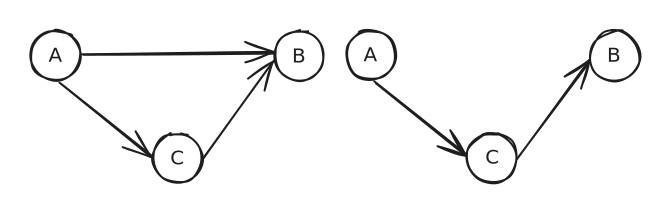

# Moderator, Mediator, Confounding Variable in Causal Diagram

This is a quick information discussion of moderator, mediator, and confounding variables: what they are, and how they are drawn in a causal diagram.&#x20;

## Basic Causal Diagram of Mediator&#x20;

Mediating relationship explains how a third variable C is associated with the relationship between two other variables A and B. It means that A affects B through C.&#x20;

* On the left, we can see that A has a direct effect on B, and another effect mediated by C.
* On the right, we can see that the effect of A to B is mediated by C

## Basic Mediator Testing&#x20;

There have been many developments ever since the original work by Baron and Kenny on identifying mediators, but here I briefly discuss the intuition behind one of the earliest works (perhaps, as far as I know)  on testing mediation outlined in ["The moderator-mediator variable distinction in social psychological research: conceptual, strategic, and statistical consideration" in 1986 JPSP ](https://pubmed.ncbi.nlm.nih.gov/3806354/)

Three regressions can be used to test mediation:&#x20;

1. $$C \sim A$$, first, we want to see the independent variable A affects the mediator C.&#x20;
2. $$B \sim A$$, second, we want to see that independent variable A affects the dependent variable B&#x20;
3. $$B \sim C$$, third, we want to see that mediator C affects the dependent variable B

If all three is true, then we know the effect of the independent variable A on dependent variable B must be mediated by C.&#x20;

Perfect mediation (top right) holds that when $$B\sim A + C$$ regression shows that A has no significant effect and C has. (Because A must affect C, having both A and C in the regression already can introduce other issues, but this is temporarily outside of the scope of this note).&#x20;

## Basic Causal Diagram of Moderator&#x20;

Moderating relationship also explains how a third variable C is associated with the relationship between two other variables A and B. It means that the effect of A on B is dependent on C.&#x20;

However, in a causal graph, displaying a moderating relationship is a bit more chaotic. Below are four different ways you might encounter them.

**Top left: The technically correct way**&#x20;

Surprise! Technically this is the correct version. Because in a causal diagram only describes what variables affect what variables, it does not display how. So the graph only tells us that both A and C affect B, but below are some different ways all represented by the same diagram&#x20;

* $$B =  A + C$$: In this example, we can see that A and C are independently affecting B&#x20;
* $$B= A + A * C$$: In this example, we can see that A is affecting B, and also there is a moderation effect of C on the relationship between A and B.&#x20;
* $$B = A + A*C + C$$: In this example, we can see that A, and C are both independently affecting C, and there is also a moderation effect. &#x20;

As [Judea Pearl said in this Tweet](https://x.com/yudapearl/status/1278279848356573184), In causal diagrams every variable in understood to be a moderator.&#x20;

**Top right: The most explicit way**

Although the top left representation is correct, it is a bit hard to explicitly show the moderating relationship. The top right is one way to show the moderating relationship very explicitly, this is also featured in Baron & Kenny, 1986. This sort of causal diagram assumes that an arrow from A to B only means that A is independently affecting B. Here is a breakdown:&#x20;

* The arrow from A to B: A is affecting B&#x20;
* The arrow from A to A\*C: A is affecting the interaction term A\*C
* The arrow from C to A\*C: C is affecting the interaction term A\*C
* The arrow from A\*C to is affecting B (this is the interaction effect)&#x20;
* No arrow from C to B: This means that C only affects B through the interaction term

**Bottom: Common Alternative and Mathematical Equivalency**&#x20;

Another way to represent the moderation relationship is by pointing the arrow to another arrow instead of a node. So in the bottom left, we can see that C has an arrow pointing to the arrow from A to B. This means that the C is affecting how A affects B, or, the effect of A to B is moderated by C.&#x20;

Mathematically, interaction is symmetrical. So if the effect of A to B is moderated by C, then the effect of C to B is also moderated by A. That's what the bottom right graph shows. However, in terms of theoretical interpretation, they are different.&#x20;

##

