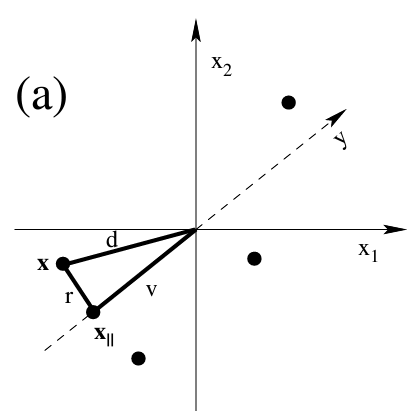

# A Simple 2D PCA Example

## Setup

In the example below, $$x=\begin{bmatrix}x_1 \\ x_2\end{bmatrix}$$ is a point, $$v$$is a unit vector that defines the project space. Assuming 0 means for simplicity.&#x20;

<figure><figcaption>
A simple PCA example
</figcaption></figure>

* $$y$$ is the scalar projection of $$x$$ onto $$v$$ is given by $$x\cdot v = v^Tx$$
* $$x_{||}$$, which is the projection vector, is given by $$y v=vv^Tx$$
*   The error is the average L2 norm between original points and projected points (assuming $$M$$ points and $$l$$ dimension.&#x20;

    $$E:= \langle \lVert x^\mu -x_{||}^\mu\rVert\rangle_\mu=\frac{1}{M}\sum_{\mu=1}^M\sum_{i=1}^l(x_i^\mu-x_{||i}^\mu)^2$$

## Equivalence between maximizing the variance and minimizing reconstruction error

Assuming mean 0 for easier understanding, it is easy to see that minimizing the reconstruction error is equivalent to maximizing the variance of the projected data.  In this case, we have $$r^2 + v^2 = d^2$$ where $$r$$ is the reconstruction error and $$v$$is the new spread and $$d$$ is the original length.&#x20;

<figure><figcaption>
Showing the relationship between r, v, and d
</figcaption></figure>

## Motivating Covariance Matrix in Determining Maximal Variance

Consider the data matrix $$X=\begin{bmatrix} x_1^1 & x_1^2 & x_1^3 \\ x_2^1 & x_2^2 & x_2^3 \end{bmatrix}$$where each column is a point, then its covariance matrix $$C = E[XX^T] =E\begin{bmatrix}  C_{11} & C_{12} \\ C_{21} & C_{22}\end{bmatrix}$$

$$C_{11}$$is the variance of the first component and $$C_{22}$$ is the variance of the second component. If $$C_{11}$$is a lot larger than $$C_{22}$$, then in order to preserve most of the variance, the direction of the projection should be close to $$\begin{bmatrix} 1 \\ 0 \end{bmatrix}$$ and vice versa.

If $$C_{11}, C_{22}$$are similar, then we can look at the covariance $$C_{12}$$, a large positive value indicates strong positive correlation between the first and second components, so the projection should be around $$\begin{bmatrix} 1 \\ 1 \end{bmatrix}$$. A small value indicates little structure / no prominent direction of maximal variance. Note by Cauchy-Schwarez we have $$C_{12}^2 \leq C_{11} * C_{22}$$  &#x20;

However, the covariance matrix only gives information about the second-order moment. Below are three examples of different data points with the same covariance matrix. So if we are ONLY considering the covariance matrix, it's ok to assume the data to be Gaussian distributed with an ellipsoid shape.&#x20;

<figure><figcaption>
Same covariance matrix
</figcaption></figure>

## Connections Among Covariance Matrix, Rotation and Eigenvectors&#x20;

Notice that if the covariance matrix is diagonal / almost diagonal, then finding the direction for maximum variance is easy. It is the axis belonging to the largest value on the diagonal entry. If the data cloud is oblique / covariance entry is not diagonal, then the case is harder.&#x20;

Therefore, one way to solve this problem is to make the non-diagonal covariance matrix diagonal by rotating the coordinate system as shown below&#x20;

<figure><figcaption>
Rotaing data to make diagonal covariance matrix
</figcaption></figure>

As it turns out, the eigenvectors of the covariance matrix point to the direction of maximal variance, and the eigenvalues are equal to the variances along this direction. This means projecting the data onto eigenvectors with the largest eigenvalues is the first PCA projection plane.&#x20;

## Additional Example of  Rotation ([Link](https://drive.google.com/file/d/1iBYkI6lHluUKKNqhAqkWnHPcJNCA9-OI/view?usp=share\_link))

First consider the extreme case of $$y=n x, x\sim \text{Unif}(0,1)$$. We create both variables and mean center it, then fed into a PCA to get 2 principle components. We plot the original data in blue and PCA transformed data (based on the rotation matrix of PCA) in orange.&#x20;

<figure><figcaption>
y=nx PCA Demo
</figcaption></figure>

We can see that there is only one direction (horizontal) post transformation, which is the original unfirom sampling on x axis.&#x20;

If we look at the rotation matrix, it is equal to $$R=\begin{bmatrix} \cos(45^\circ) & \sin(45^\circ) \\ -\sin(45^\circ) & \cos(45^\circ) \end{bmatrix}$$, which is a $$45^\circ$$ rotation. The explained variance is $$(0.166,0)$$. So the first principle component has all the explained variance since the original variance is $$Var(x) + Var(y)=0.1666$$ based on uniform sampling.&#x20;

In a more complicated example, we can generate $$X$$and $$Y$$ as two independent normal variables with different varianec, and then apply a rotation matrix to make them correlated. We can then attempt to decouple this through the principal component. Here blue is the original post rotation data and organge is the recovered data.&#x20;

<figure><figcaption></figcaption></figure>

&#x20;

